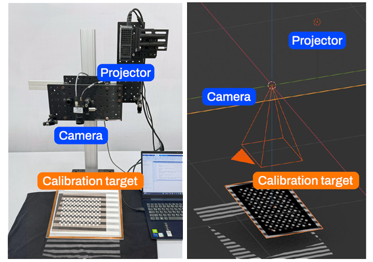
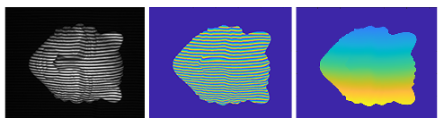

# Deep learning assisted high-speed fringe projection profilometry

**This is the main repository for the deep learning-aided fringe projection profilometry (FPP) framework.**

With the proposed technique, we integrate a depth prediction model with phase unwrapping guided by geometric constraints to overcome the limitations of traditional FPP, which typically relies on multiple image acquisitions and computationally intensive phase analysis. Our approach employs a transformer-based model fine-tuned for single-shot depth prediction from fringe images, enhancing robustness and accuracy in challenging scenarios such as complex surface geometries or dynamic environments.


To support training and evaluation, a synthetic dataset is generated using a digital twin of the FPP system within Blender. This integration of AI-driven depth prediction with geometric priors reduces dependency on multi-image phase unwrapping and enables high-speed 3D reconstruction.

In this repository, code and resources for deep learning-assisted FPP reconstruction are available, including:

- Implementation of depth prediction and geometric constraint integration.  
- Tools for synthetic dataset generation with Blender.  
- Training and evaluation pipeline with DepthAnythingV2 (will be available soon).  

## Dependencies
<a href="https://www.blender.org/" target="_blank" rel="noreferrer">  </a><a href="https://www.python.org" target="_blank" rel="noreferrer">  </a><a href="https://opencv.org/" target="_blank" rel="noreferrer">  </a><a href="https://numpy.org/" target="_blank" rel="noreferrer">  </a><a href="https://www.blender.org/" target="_blank" rel="noreferrer">  

- [Blender](https://www.blender.org/) 
- [Python3](https://www.python.org/)
- [OpenCV](https://opencv.org/)
- [NumPy](https://numpy.org/)
- [PyTorch](https://pytorch.org/)

***All necessary dependencies and software are Open-Sourse**

## Structure of the repository
The repository is organized as follows:

- ```digital_twin/``` – Code, resources, and Blender project for generating synthetic datasets using a Blender-based digital twin of the FPP system.
- ```ps_unwrapping/``` – Implementation of phase unwrapping by geometric constraints algorithm with local $Z_{min}$.
- ```virtual_calib/``` – Code needed to perform a virtual calibration for the camera or the structured light system.
- ```data/``` – Resources required to run ```ps_unwrapping/``` scripts.
- ```scripts/``` – Utility scripts related to data generation and FPP processing. (Training and evaluation pipelines will be added soon.)
- ```figures/``` – Figures and diagrams for documentation and visualization.

## Digital twin

This section explain how to establish a Digital twin of a structured light system with Blender. You require the real-world SL calibration parameters. You can use the example calibration parameters in  ```data/calib_params/One stage_TSC_0_calib_pyread2.mat```

<p align="center">
  
</p>

1. If you have **CUDA-compatible graphics**, you can select it for rendering in the following settings. *Blender Preferences > System > Cycles Render Devices > CUDA.
2. Install OpenCV and Scipy in Blender. For this, go to the Blender python root: `cd C:\Program Files\Blender Foundation\Blender 4.0\4.0\python`. Then, run the following command in terminal `bin/python.exe -m pip install opencv-python -t "C:\Program Files\Blender Foundation\Blender 4.X\4.X\python\lib\site-packages"`. *If the module folder of your Blender python installation is different, change the target path.*
3. Open the Blender project in `digital_twin/structured_light_digital_twin.blend`
4. In the Scripting window, run the following scripts:
    1. `camera.py` for the virtual camera
    2. `projector.py` for the virtual projector
5. You can change the projected image modifying `projector.py`

## Unwrapping with predicted depth example

With this example, you can perform phase unwrapping guided by the predicted depth map obtained from the deep learning model.  

<p align="center">
  
</p>

The predicted depth provides geometric constraints that help resolve ambiguities in the wrapped phase, improving robustness compared to traditional unwrapping methods.  

This allows more accurate reconstruction of complex surfaces and reduces the need for multi-image acquisitions.  

To run this example:

1. Clone this repository: git clone https://github.com/fquinterov/deep-learning-hs-fpp.git
2. `cd deep-learning-hs-fpp`
3. Run `ps_unwrapping\unwrapping_dl.py` to perform the phase unwrapping by geometric constraints of the wrapped phase of a mask surface located in `data\example\mask_wrapped_phase.mat`. It uses as reference the predicted depth `mask_depth_pred.npy`.