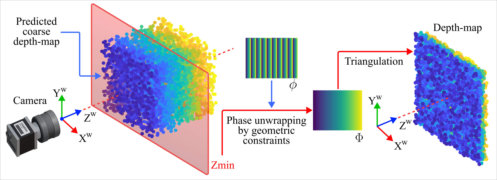

# Deep learning assisted high-speed fringe projection profilometry

**This is the main repository for the deep learning-aided fringe projection profilometry (FPP) framework.**

With the proposed technique, we integrate a depth prediction model with phase unwrapping guided by geometric constraints to overcome the limitations of traditional FPP, which typically relies on multiple image acquisitions and computationally intensive phase analysis. Our approach employs a transformer-based model fine-tuned for single-shot depth prediction from fringe images, enhancing robustness and accuracy in challenging scenarios such as complex surface geometries or dynamic environments.



To support training and evaluation, a synthetic dataset is generated using a digital twin of the FPP system within Blender. This integration of AI-driven depth prediction with geometric priors reduces dependency on multi-image phase unwrapping and enables high-speed 3D reconstruction.

In this repository, code and resources for deep learning-assisted FPP reconstruction are available, including:

- Implementation of depth prediction and geometric constraint integration.  
- Tools for synthetic dataset generation with Blender.  
- Training and evaluation pipeline with DepthAnythingV2 (will be available soon).  

## Dependencies
<a href="https://www.blender.org/" target="_blank" rel="noreferrer">  </a><a href="https://www.python.org" target="_blank" rel="noreferrer">  </a><a href="https://opencv.org/" target="_blank" rel="noreferrer">  </a><a href="https://numpy.org/" target="_blank" rel="noreferrer">  </a><a href="https://www.blender.org/" target="_blank" rel="noreferrer">  

- [Blender](https://www.blender.org/) 
- [Python3](https://www.python.org/)
- [OpenCV](https://opencv.org/)
- [NumPy](https://numpy.org/)
- [PyTorch](https://pytorch.org/)

***All necessary dependencies and software are Open-Sourse**

## Structure of the repository
The repository is organized as follows:

- ```digital_twin/``` – Code, resources, and Blender project for generating synthetic datasets using a Blender-based digital twin of the FPP system.
- ```ps_unwrapping/``` – Implementation of phase unwrapping by geometric constraints algorithm with local $Z_{min}$.
- ```scripts/``` – Utility scripts related to data generation and FPP processing. (Training and evaluation pipelines will be added soon.)
- ```figures/``` – Figures and diagrams for documentation and visualization.


## Set-up and Installation
1. Download and install the **Blender Projector Add-on** from this repository. [Guide to installing plugins in Blender](https://docs.blender.org/manual/en/latest/editors/preferences/addons.html)
2. If you have **CUDA-compatible graphics**, you can select it for rendering in the following settings. *Blender Preferences > System > Cycles Render Devices > CUDA.
3. Install OpenCV and Scipy in Blender. Aquí recomiendo instalar los paquetes en tu instalación de Python y luego copiarlos en la ruta `C:/Program Files/Blender Foundation/Blender 3.x/3.x/python/lib/site-packages/`
